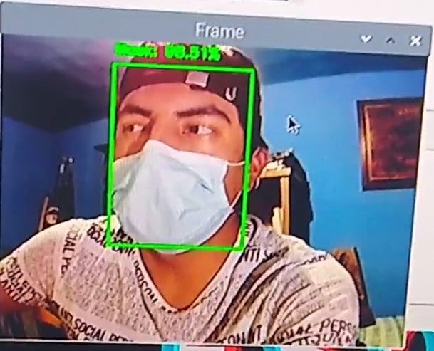
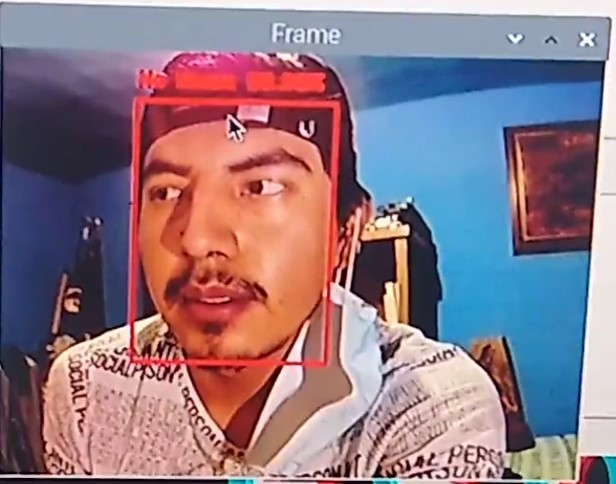

# 🛡️ Detección de Mascarillas Faciales con OpenCV y TensorFlow

Este proyecto implementa un sistema en tiempo real de detección de mascarillas faciales usando una webcam. Utiliza un modelo de detección de rostros basado en OpenCV y un modelo de clasificación de uso de mascarilla entrenado con Keras/TensorFlow.

---

## 📸 Características

- Detección de rostros en tiempo real desde la cámara web.
- Clasificación de cada rostro como "Con mascarilla" o "Sin mascarilla".
- Visualización de resultados en vivo con etiquetas y recuadros de colores.
- Guardado automático de los rostros detectados en una carpeta local.




## 📁 Estructura del Proyecto

├── face_detector/
│ ├── deploy.prototxt
│ └── res10_300x300_ssd_iter_140000.caffemodel
├── mask_detector.model
├── detect_mask_video.py
└── README.md

## 🧠 Requisitos

- Python 3.x
- TensorFlow (2.x)
- OpenCV
- Imutils
- NumPy

Instala las dependencias con:

```bash
pip install -r requirements.txt

📄 Licencia

Este proyecto es de uso educativo. Puedes modificarlo y usarlo bajo tu propio riesgo.
